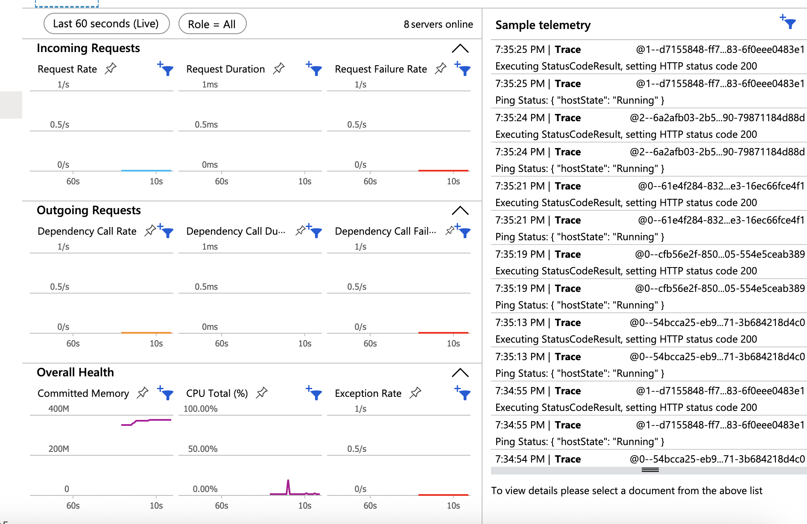

# Entrega Aula <03> — Grupo <10>

**Disciplina:** Cloud & Cognitive Environments — FIAP MBA AI Engineering & Multi-Agents
**Turma:** 1AIE #
**Data de entrega:** 06/09/2026

## Grupo

| # | Nome completo | GitHub | E-mail FIAP |
|---|---------------|--------|-------------|
| 1 | Natanael F. Ramos Filho | https://github.com/Natan5533 | rm373022@fiap.com.br |
| 2 | Gabriel A. Reis da Silva | https://github.com/gabriel-reis-silva | rm373082@fiap.com.br |
| 3 | Douglas Gomes Batista de Almeida | | rm371081@fiap.com.br |

## Distribuição do trabalho

| Membro | Nível assumido | Item específico |
|--------|----------------|-----------------|
| Natanael | 🟢 N1 | Exercícios 1.1, 1.2, 1.3 |
| Douglas | 🟢 N1 | Exercício 1.4 — Dockerfile review |
| Douglas/Natanael | 🟢 N1 | Exercício 1.4 — Dockerfile review |
| Natanael | 🟡 N2 | Exercício 2.1 — Cálculo de frete |
| Douglas | 🟡 N2 | Exercício 2.2 — Application Insights e observabilidade |
| Gabriel | 🟡 N2 | Exercício 2.3 — Endurecimento e dimensionamento do ACI |
| N/A | 🔴 N3 (bônus) | Nível 3 — Tool de Agente + Benchmark + CI/CD |
| Douglas | 🟢 N1 (apoio) | Revisão das respostas N1 |

> Regra: cada membro deve ter pelo menos uma contribuição. O rodízio entre aulas é incentivado.

---

## 🟢 Nível 1 — Respostas

### Exercício 1.1 — Quando usar Serverless?

| Cenário | Escolha | Justificativa |
|---------|---------|---------------|
| API de busca de produtos (1M chamadas/mês, picos na Black Friday) | **Function** | Escala automaticamente conforme a demanda e permite pagar pelo uso. |
| Worker que processa pedidos da fila (1000 pedidos/dia, picos noturnos) | **Function** | Pode utilizar Queue Trigger e escalar conforme a chegada de mensagens. |
| API legado em Java Spring Boot (não pode reescrever, time conhece) | **Container Apps** | Permite executar a aplicação existente em container sem reescrevê-la como Function. |
| Pipeline de processamento de imagens de produtos (chega 1 hora por noite) | **ACI** | Adequado para processamento batch temporário sem manter infraestrutura ativa o dia inteiro. |
| Microserviço de pagamentos (regulado, precisa logs detalhados, 100 req/s constante) | **Container Apps** | Adequado para um serviço containerizado com tráfego constante e necessidade de observabilidade e controle. |
| Plataforma com 25 microserviços + service mesh (Itaú-like) | **AKS** | Oferece maior controle de orquestração e suporte a arquiteturas complexas com service mesh. |
| Container que extrai dados uma vez por dia e morre | **ACI** | Adequado para containers executados como jobs pontuais. |

---

### Exercício 1.2 — Managed Identity vs alternativas

| Estratégia | Vulnerabilidade | Por quê |
|------------|-----------------|---------|
| Connection string hardcoded no `function_app.py` | **Alta** | A credencial fica diretamente no código e pode vazar pelo repositório. |
| Connection string em variável de ambiente do Function App | **Média** | O segredo sai do código, mas a credencial ainda precisa ser armazenada e gerenciada. |
| Connection string em Key Vault, lida via API key do Vault | **Média** | O segredo fica no Key Vault, mas ainda existe uma credencial para acessá-lo. |
| Connection string em Key Vault, lida via Managed Identity | **Baixa** | O acesso ao Key Vault ocorre pela identidade do recurso, sem credenciais no código. |
| Sem connection string — Managed Identity diretamente no recurso (Storage) | **Baixa** | Elimina a connection string e utiliza identidade e RBAC diretamente no recurso. |

**Pergunta adicional:**

Com a connection string hardcoded, um vazamento do código no GitHub também vaza a credencial. Nas demais estratégias, a credencial não está diretamente no código. As opções com **Managed Identity** são as mais seguras, pois evitam armazenar credenciais de autenticação na aplicação.

---

### Exercício 1.3 — Cold start na prática

| Chamada | Tempo decorrido | Observação |
|---------|-----------------|------------|
| 1 (fria) | 1,42 s | Primeira chamada após período de inatividade. |
| 2 (quente) | 0,18 s | Chamada realizada 5 segundos depois. |
| 3 (fria de novo) | 1,31 s | Chamada realizada após 30 minutos. |

**Pergunta:**

Com uma chamada por hora, existe alta possibilidade de cold start se a Function estiver em um plano que escala a zero, mas não é possível garantir que todas as 24 chamadas serão frias.

Se a UX exige resposta abaixo de 500 ms, utilizaria uma configuração com instâncias sempre disponíveis para reduzir cold starts.

---

### Exercício 1.4 — Dockerfile review

| Problema | Melhoria |
|----------|----------|
| Usa `python:3.11`, uma imagem maior | Utilizar `python:3.11-slim`. |
| `COPY . .` copia arquivos desnecessários | Utilizar `.dockerignore`. |
| `pip install` mantém cache | Utilizar `--no-cache-dir`. |
| Executa como root | Criar e utilizar um usuário sem privilégios. |
| Não possui health check | Adicionar `HEALTHCHECK`. |

Exemplo melhorado:

```dockerfile
FROM python:3.11-slim

WORKDIR /app

COPY requirements.txt .
RUN pip install --no-cache-dir -r requirements.txt

COPY . .

RUN useradd -m appuser
USER appuser

EXPOSE 8000

HEALTHCHECK CMD curl --fail http://localhost:8000/health || exit 1

CMD ["python", "app.py"]
```

---

## 🟡 Nível 2 — Respostas + Implementação

### Exercício 2.1 — Adicionar segunda tool no agente: cálculo de frete

#### a) Function App

A Function `calcular_frete` pode ficar no **mesmo Function App**, pois pertence ao mesmo contexto da QC e possui requisitos semelhantes de execução e escala.

#### b) Function `calcular_frete`

Adicionar ao `function_app.py`:

```python
@app.route(route="calcular_frete", methods=["POST"])
def calcular_frete(req: func.HttpRequest) -> func.HttpResponse:
    try:
        body = req.get_json()

        cep_origem = body.get("cep_origem")
        cep_destino = body.get("cep_destino")
        peso = float(body.get("peso"))

        if not cep_origem or not cep_destino or peso <= 0:
            return func.HttpResponse(
                "Dados inválidos",
                status_code=400
            )

        # Cálculo determinístico simplificado para o exercício
        distancia_km = abs(int(cep_origem[:3]) - int(cep_destino[:3]))

        valor = 10 + (distancia_km * 0.10) + (peso * 2)
        prazo_dias = max(1, int(distancia_km / 100) + 1)

        resultado = {
            "valor": round(valor, 2),
            "prazo_dias": prazo_dias
        }

        return func.HttpResponse(
            json.dumps(resultado),
            mimetype="application/json",
            status_code=200
        )

    except (ValueError, TypeError):
        return func.HttpResponse(
            "Dados inválidos",
            status_code=400
        )
```

> O arquivo deve manter os imports já utilizados pela Function App, incluindo `azure.functions as func` e `json`.

#### c) Terraform

Como a nova Function utiliza o **mesmo Function App**, não é necessário criar outro Function App no Terraform.

#### d) Tool em JSON Schema

```json
{
  "name": "calcular_frete",
  "description": "Calcula o valor e o prazo estimado do frete entre dois CEPs.",
  "input_schema": {
    "type": "object",
    "properties": {
      "cep_origem": {
        "type": "string",
        "description": "CEP de origem."
      },
      "cep_destino": {
        "type": "string",
        "description": "CEP de destino."
      },
      "peso": {
        "type": "number",
        "description": "Peso do produto em quilogramas."
      }
    },
    "required": [
      "cep_origem",
      "cep_destino",
      "peso"
    ]
  }
}
```

#### e) Quando separar Function Apps?

Criaria outro Function App quando as funções tivessem requisitos diferentes de **segurança, configuração, escala, deploy ou ciclo de vida**. Funções relacionadas e com requisitos semelhantes podem permanecer no mesmo App.

---

### Exercício 2.2 — Application Insights e observabilidade

#### a) Terraform

Adicionar o Application Insights:

```hcl
resource "azurerm_application_insights" "qc" {
  name                = "appi-qc-aula03"
  location            = azurerm_resource_group.qc.location
  resource_group_name = azurerm_resource_group.qc.name
  application_type    = "web"
}
```

Conectar à Function:

```hcl
site_config {
  application_insights_connection_string = azurerm_application_insights.qc.connection_string
}
```

> Ajustar os nomes dos resources para os mesmos utilizados no Terraform do grupo.

#### b) Live Metrics

Realizar **20 chamadas variadas** à Function e adicionar o print do **Application Insights → Live Metrics**.



#### c) Failures e latência

| Métrica | Resultado |
|---------|-----------|
| Taxa de falhas | 0,0% (0 de 61 requests)|
| p95 de latência | 	~1,17 s|
| Gargalo identificado | Não há sinal de CPU ou memória saturadas; o principal indício é instabilidade do worker (Language Worker Process exited), então o gargalo parece estar no runtime/execução da Function, não em compute |


#### d) Observabilidade em sistema multi-agente

Utilizaria **OpenTelemetry** para padronizar logs, métricas e traces distribuídos. Também utilizaria IDs de correlação para acompanhar uma requisição entre agentes, tools e serviços e centralizaria a telemetria no Application Insights.

---

### Exercício 2.3 — Endurecer e dimensionar o ACI da QC

#### a) Restart policy

Para um job batch:

```hcl
restart_policy = "OnFailure"
```

| Policy | Quando usar |
|--------|-------------|
| `Always` | Serviços que devem permanecer continuamente ativos. |
| `OnFailure` | Jobs que devem reiniciar apenas quando ocorrer uma falha. |
| `Never` | Jobs que devem executar uma única vez, sem reiniciar. |

---

#### b) Right-sizing + custo

Variante com `1 vCPU / 2 GB`:

```hcl
resources {
  requests {
    cpu    = 1
    memory = 2
  }
}
```

Após consultar o Azure Pricing Calculator:

| Configuração | Custo/hora | Custo 24/7 |
|--------------|------------|------------|
| ACI 0.5 vCPU / 1 GB | ~US$ 0,048/h | ~US$ 1,15/dia |
| ACI 1 vCPU / 2 GB | ~US$ 0,053/h | ~US$ 1,26/dia |
| Function equivalente | ~US$ 0,029/h | ~US$ 0,69/dia |

O **ACI cobra enquanto o container existir**, enquanto uma Function em modelo de consumo pode escalar a zero e reduzir o custo quando não existem requisições.

---

#### c) Segredo via secure env

Mover uma configuração sensível para:

```hcl
secure_environment_variables = {
  API_KEY = "PREENCHER"
}
```

Em vez de:

```hcl
environment_variables = {
  API_KEY = "PREENCHER"
}
```

Executar:

```bash
az container show \
  --resource-group <RESOURCE_GROUP> \
  --name <CONTAINER_NAME>
```

**Resultado observado:** `PREENCHER`

A diferença esperada é que valores definidos como `secure_environment_variables` não sejam exibidos em texto plano ao inspecionar o container.

---

#### d) Limite de réplica única

O ACI não possui autoscale nativo e executa uma réplica fixa. Em um pico como a **Black Friday**, essa instância pode se tornar um gargalo.

Para esse cenário, utilizaria **Container Apps**, pois oferece autoscaling para aplicações containerizadas com menor complexidade operacional que um cluster AKS.

---

#### e) ACI vs Function

| Workload | Escolha | Motivo |
|----------|---------|--------|
| Job batch em container | **ACI** | Simples para executar um container temporário e encerrá-lo. |
| Processamento pontual diário | **ACI** | Evita manter infraestrutura permanente. |
| API com chamadas esporádicas | **Function** | Pode escalar a zero e cobrar pelo uso. |
| Processamento baseado em eventos | **Function** | Possui triggers e escala automática baseada na demanda. |

Para a QC, utilizaria **ACI para workloads batch ou containers pontuais** e **Functions para APIs e processamento orientado a eventos**, principalmente quando houver períodos sem utilização.

---

## 🔴 Nível 3 — Bônus (se aplicável)

---

## Reflexão coletiva

Nesta aula, aprendemos as diferenças entre serverless e containers e como escolher a solução de acordo com o tipo de workload. Functions são adequadas para processamento orientado a eventos e cargas variáveis, enquanto containers oferecem maior controle sobre a aplicação e seu ambiente de execução.

Também entendemos a importância de segurança e observabilidade em aplicações cloud. Managed Identity reduz a necessidade de armazenar credenciais, enquanto Application Insights e OpenTelemetry permitem acompanhar métricas, logs e traces das aplicações.

Em uma plataforma agentic, esses conceitos permitem que as tools sejam executadas de forma escalável e segura. Se começássemos o projeto QC hoje, separaríamos os workloads desde o início entre Functions, containers e serviços de orquestração de acordo com seus requisitos de escala, custo e complexidade operacional.

---

## Artefatos do ZIP

- Print Application Insights: `PREENCHER`
- Código Function: `PREENCHER`
- Terraform atualizado: `PREENCHER`
- Evidência ACI: `PREENCHER`
- Endpoint ativo (se houver): `PREENCHER`
